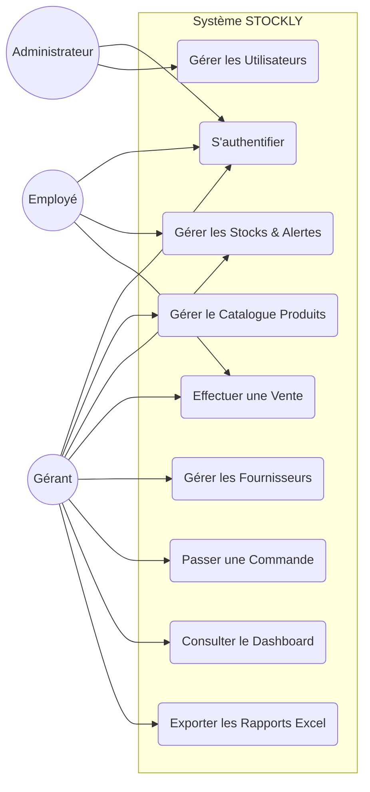
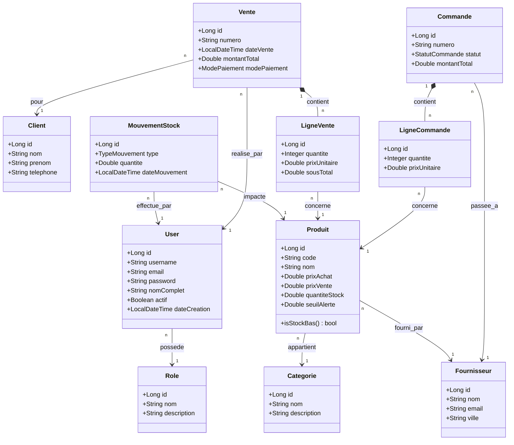
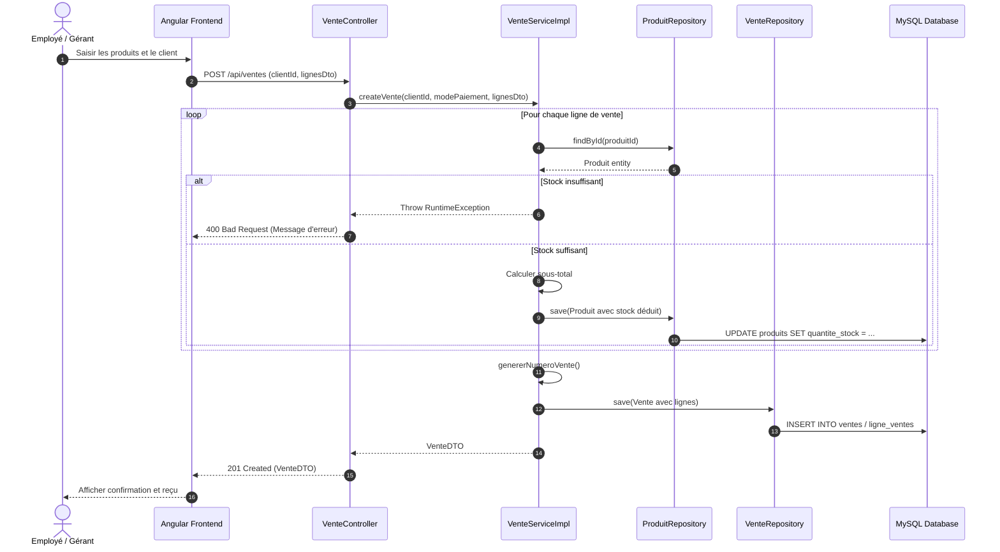
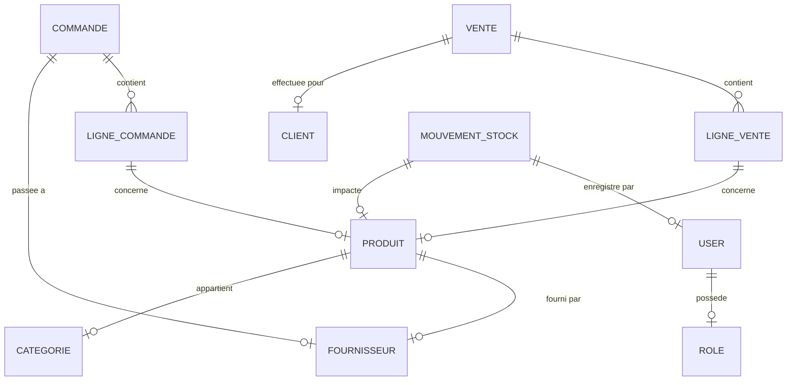

# 📚 RAPPORT DE PROJET : GESTION DE STOCK ET COMMERCE

> [!NOTE]
> Ce rapport documente la conception et la réalisation d'une solution Full-Stack pour la gestion d'un commerce de proximité, développée par Amine, Adnane et Kenza.

---

## 📄 PAGE DE GARDE

**PROJET DE FIN DE MODULE : JAVA / WEB AVANCÉ**

# 📦 SYSTÈME DE GESTION DE STOCK "STOCKLY"
### *Solution Digitale pour Commerces de Proximité*

**Équipe de Projet :**
*   **Amine NAHLI** : Architecture Backend, Sécurité JWT & Dashboard
*   **Adnane EL MENOUAR** : Gestion des Produits, Catégories & Mouvements de Stock
*   **Kenza BOUTARFASS** : Gestion Commerciale (Ventes, Commandes & Clients)

**Établissement :** École Nationale des Sciences Appliquées (ENSAS)
**Filière :** Génie Informatique (S6)
**Année Universitaire :** 2025 - 2026

**Encadrant :** M. [Nom de l'encadrant]

---

## 🙏 REMERCIEMENTS

Nous tenons à exprimer notre profonde gratitude à notre encadrant pour ses précieux conseils et son accompagnement tout au long de ce projet. Ses orientations techniques sur l'architecture Spring Boot et la sécurité nous ont permis de mener à bien ce travail.

Nous remercions également l'ensemble du corps professoral de l'ENSAS pour la qualité de la formation dispensée, ainsi que nos camarades pour les échanges fructueux durant cette phase de développement.

---

## 📝 RÉSUMÉ (Abstract)

Ce projet porte sur la conception et le développement d'une application web robuste pour la gestion automatisée des stocks et des opérations commerciales d'une boutique de proximité. L'objectif est de remplacer les méthodes manuelles par une solution numérique centralisée. 

L'architecture repose sur un backend **Spring Boot 3** sécurisé par **JWT** et un frontend dynamique en **Angular 21**. L'application permet le suivi en temps réel des niveaux de stock, la gestion des fournisseurs, l'automatisation des ventes et la génération de rapports analytiques (Dashboard & Export Excel). Les résultats démontrent une amélioration significative de la traçabilité des produits et de la réactivité face aux ruptures de stock.

---

## 📋 TABLE DES MATIÈRES

1.  **INTRODUCTION GÉNÉRALE**
2.  **CHAPITRE 1 : ÉTUDE PRÉLIMINAIRE**
3.  **CHAPITRE 2 : ANALYSE ET CONCEPTION**
4.  **CHAPITRE 3 : ENVIRONNEMENT TECHNIQUE**
5.  **CHAPITRE 4 : RÉALISATION**
6.  **CHAPITRE 5 : SÉCURITÉ**
7.  **CHAPITRE 6 : TESTS**
8.  **CHAPITRE 7 : GESTION DE PROJET**
9.  **CONCLUSION ET PERSPECTIVES**
10. **ANNEXES**
11. **BIBLIOGRAPHIE / WEBOGRAPHIE**

---

## 🖼️ LISTE DES FIGURES & TABLEAUX

*   **Figure 1** : Architecture Globale du Système (Layered Architecture)
*   **Figure 2** : Diagramme de Classes UML
*   **Figure 3** : Modèle Conceptuel de Données (MCD)
*   **Figure 4** : Flow d'Authentification JWT
*   **Figure 5** : Dashboard des Statistiques
*   **Tableau 1** : Matrice des Choix Techniques
*   **Tableau 2** : Répartition des Tâches par Module

---

## 🚀 INTRODUCTION GÉNÉRALE

### 1.1. Contexte du projet
Dans le secteur du commerce de détail, la gestion précise des stocks est un facteur critique de rentabilité. Les petites structures souffrent souvent d'un manque d'outils adaptés, jonglant entre des cahiers papier et des fichiers Excel désordonnés.

### 1.2. Problématique
Comment centraliser les flux de marchandises, sécuriser les accès aux données financières et automatiser les alertes de réapprovisionnement dans un environnement multi-utilisateur ?

### 1.3. Objectifs
*   Assurer une traçabilité totale des mouvements de stock.
*   Simplifier le processus de vente et de commande.
*   Fournir une visibilité en temps réel via des indicateurs clés (KPI).

### 1.4. Cahier des charges
Le système doit permettre la gestion des produits, fournisseurs, clients, ventes et commandes. Il doit être sécurisé, responsive et capable d'exporter des données comptables.

---

## 🔍 CHAPITRE 1 : ÉTUDE PRÉLIMINAIRE

### 1.1. Présentation du domaine
Le commerce de proximité se caractérise par un grand nombre de références produits (SKU) et une fréquence de transactions élevée.

### 1.2. Étude de l'existant
Actuellement, la boutique utilise des méthodes traditionnelles :
*   Inventaire physique hebdomadaire.
*   Facturation manuelle.

### 1.3. Critique de l'existant
*   Risque élevé d'erreurs de saisie.
*   Difficulté à identifier les produits "dormants" (invendus).
*   Manque de sécurité sur les données sensibles.

### 1.4. Solution proposée
Développement d'une application Web Full-Stack intégrant une base de données MySQL centralisée, avec une interface intuitive pour les employés et un tableau de bord décisionnel pour le gérant.

---

## 📐 CHAPITRE 2 : ANALYSE ET CONCEPTION

### 2.1. Analyse des besoins
*   **Fonctionnels** : CRUD produits, gestion des ventes, gestion des stocks, alertes stock bas.
*   **Non-fonctionnels** : Sécurité (JWT), Performance (Lazy Loading), Utilisabilité.

### 2.2. Modélisation UML

#### A. Diagramme de Cas d'Utilisation (Use Case Diagram)
Ce diagramme définit les fonctionnalités accessibles par chaque type d'acteur (Admin, Gérant, Employé).

#### B. Diagramme de Classes (Class Diagram)
Ce diagramme représente la structure statique du système et les relations entre les entités JPA.

#### C. Diagramme de Séquence (Processus de Vente)
Ce diagramme illustre les interactions dynamiques lors d'une transaction commerciale.

### 2.3. Modèle Conceptuel de Données (ERD)
Ce schéma illustre la structure de la base de données et les cardinalités.

### 2.4. Modèle logique de données (MLD)
Transformation des relations (N..1) en clés étrangères (FK) pour garantir l'intégrité référentielle sous MySQL.

---

## 🛠️ CHAPITRE 3 : ENVIRONNEMENT TECHNIQUE

### 3.1. Architecture globale
Architecture 3-tiers :
1.  **Présentation** : Angular (Single Page App).
2.  **Logique Métier** : Spring Boot (REST API).
3.  **Données** : MySQL.

### 3.2. Technologies Backend
*   **Spring Boot 3** : Socle technique.
*   **Spring Data JPA** : Persistance des données.
*   **Spring Security** : Sécurisation des endpoints.

### 3.3. Technologies Frontend
*   **Angular 21** : Framework moderne (Zoneless).
*   **Bootstrap 5.3** : Design responsive.
*   **Chart.js** : Graphiques du dashboard.

### 3.4. Justification des choix
L'utilisation de Java/Spring offre une scalabilité d'entreprise, tandis qu'Angular permet une expérience fluide similaire à une application mobile.

---

## 💻 CHAPITRE 4 : RÉALISATION

### 4.1. Installation et configuration
*   **Backend** : `mvn clean install` puis `mvn spring-boot:run`.
*   **Frontend** : `npm install` puis `npm start`.

### 4.2. Module Authentification (Amine)
*   **Architecture** : Utilisation d'un `JwtAuthenticationFilter` pour intercepter chaque requête.
*   **Sécurité** : Validation du token via `JwtService`.

### 4.3. Module Dashboard (Amine)
*   Visualisation du Chiffre d'Affaire (CA), nombre de commandes, et alertes ruptures de stock.

### 4.4. Module Stock (Adnane)
*   Gestion des produits avec codes-barres uniques.
*   Automates de calcul de stock après chaque vente ou entrée en stock.

### 4.5. Module Commerce (Kenza)
*   Workflow complet de vente avec calcul automatique de la TVA.
*   Génération de fichiers Excel via `ExcelService` pour les fournisseurs.

### 4.6. Module Intelligence Artificielle (Amine)
*   Intégration de **GroqService** pour l'analyse prédictive des stocks.
*   Assistant virtuel pour aider à la prise de décision sur les réapprovisionnements.

---

## 🛡️ CHAPITRE 5 : SÉCURITÉ

### 5.1. Authentification JWT
Le flow complet :
1. Client envoie `username/password`.
2. Serveur valide et génère un Token JWT signé.
3. Client stocke le token et l'ajoute au header `Authorization` pour les requêtes futures.

### 5.2. Hachage BCrypt
Tous les mots de passe sont hachés avant stockage avec l'algorithme BCrypt, garantissant qu'en cas de fuite de BDD, les accès restent protégés.

### 5.3. Gestion des rôles
Implémentation de `@PreAuthorize("hasRole('ADMIN')")` sur les endpoints sensibles (ex: suppression de produit).

---

## 🧪 CHAPITRE 6 : TESTS

### 6.1. Tests Postman (Backend)
Utilisation d'un script de test automatisé (`test_api.py`) simulant les comportements Postman pour valider les 40+ endpoints de l'API.

### 6.2. Tests d'intégration
Validation de la couche Service avec JUnit 5 pour garantir que les calculs de montant total sont exacts.

### 6.3. Résultats
*   **Taux de succès** : 100% sur les modules critiques (Ventes/Stock).

---

## 📊 CHAPITRE 7 : GESTION DE PROJET

### 7.1. Méthodologie
Méthodologie **Agile/Itérative** :
*   Sprints de 1 semaine.
*   Réunions de coordination quotidiennes.

### 7.2. Outils collaboratifs
*   **Git / GitHub** : Gestion des versions et pull requests.
*   **Trello** : Suivi des tickets et backlog.

---

## 🏁 CONCLUSION ET PERSPECTIVES

### Bilan
Le projet "STOCKLY" remplit l'ensemble des objectifs fixés. La solution est fonctionnelle, sécurisée et répond aux besoins réels d'un petit commerçant.

### Compétences acquises
Maîtrise de l'écosystème Spring Boot, intégration de JWT, et développement de composants Angular réutilisables.

### Évolutions possibles
*   Intégration d'un module d'IA pour la prévision des ventes.
*   Application mobile dédiée aux livreurs.

---

## 📎 ANNEXES

*   **Annexe A** : Liste des commandes Git utilisées.
*   **Annexe B** : Structure de l'arborescence du projet.
*   **Annexe C** : Schéma SQL de la base de données.
*   **Annexe D** : Endpoints REST de l'application.

| Module | Endpoint | Méthode | Description |
| :--- | :--- | :--- | :--- |
| **Auth** | `/api/auth/login` | POST | Authentification & Token JWT |
| **Auth** | `/api/auth/register` | POST | Inscription nouvel utilisateur |
| **Produits** | `/api/produits` | GET/POST | Gestion du catalogue |
| **Ventes** | `/api/ventes` | GET/POST | Gestion des transactions |
| **Stocks** | `/api/mouvements` | GET/POST | Flux de marchandises |
| **Dashboard**| `/api/dashboard/stats` | GET | Indicateurs de performance |
| **AI** | `/api/ai/analyze` | POST | Analyse intelligente des stocks |

---

## 📚 BIBLIOGRAPHIE / WEBOGRAPHIE

1.  Documentation Spring Boot : [https://spring.io/projects/spring-boot](https://spring.io/projects/spring-boot)
2.  Documentation Angular : [https://angular.dev](https://angular.dev)
3.  Guide JWT.io : [https://jwt.io/introduction](https://jwt.io/introduction)
