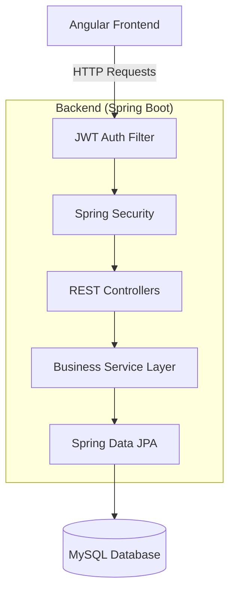
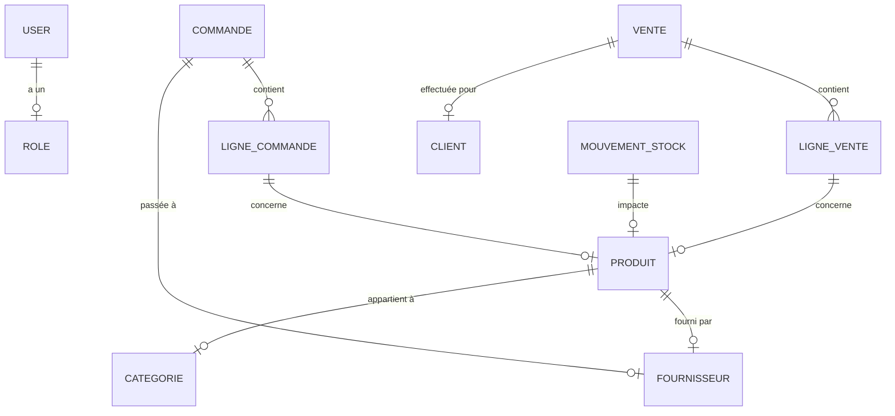

# 📦 Gestion de Stock pour Commerce de Proximité

<p align="center">
  
</p>


## Une solution Full-Stack moderne et robuste pour la gestion d'inventaire, conçue spécifiquement pour les épiceries et petites boutiques de proximité. Suivez vos stocks en temps réel, gérez vos fournisseurs et analysez vos ventes avec précision.

## 🚀 Aperçu Rapide

> [!NOTE]
> Cette application a été conçue pour offrir une expérience utilisateur fluide ("Zoneless" Angular) et une sécurité de niveau entreprise (Spring Security + JWT).

### ✨ Fonctionnalités Clés

- **📊 Dashboard IA-Ready** : Statistiques en temps réel sur le chiffre d'affaires et les ruptures de stock.
- **🛡️ Sécurité Avancée** : Authentification par token JWT avec gestion fine des rôles (Admin/Gérant/Employé).
- **📦 Gestion d'Inventaire** : Suivi des mouvements (entrées/sorties), alertes de seuil critique.
- **📄 Rapports Business** : Exportation des données vers Excel pour le suivi comptable.

---

## 📐 Architecture du Système

Le projet utilise une architecture en couches pour séparer les responsabilités et faciliter la maintenance.



---

## 📊 Modèle de Données (ER Diagram)

Voici comment sont structurées les données au cœur du système :



---

## 🛠️ Stack Technique

| Technologie     | Version | Usage                                |
| :-------------- | :------ | :----------------------------------- |
| **Java**        | 17+     | Langage robuste côté serveur         |
| **Spring Boot** | 3.x     | Framework d'API et Sécurité          |
| **Angular**     | 21      | Framework de Single Page Application |
| **MySQL**       | 8.0     | Stockage de données relationnel      |
| **Bootstrap**   | 5.3     | Design UI et Responsive              |
| **Chart.js**    | 4.x     | Visualisation de données             |

---

## 💻 Installation & Configuration

### 1️⃣ Base de Données

Créez une base MySQL nommée `gestion_stock_db`. Le système créera automatiquement les tables au premier lancement grâce à Hibernate.

### 2️⃣ Backend (API)

```bash
cd backend
mvn clean install
mvn spring-boot:run
```

### 3️⃣ Frontend (UI)

```bash
cd frontend
npm install
npm start
```

---

## 👥 Notre Équipe

<table align="center">
  <tr>
    <td align="center"><a href="#"><br /><sub><b>Nahli Amine</b></sub></a><br />Architecture & Auth</td>
    <td align="center"><a href="#"><br /><sub><b>El Menouar Adnane</b></sub></a><br />Produits & Stock</td>
    <td align="center"><a href="#"><br /><sub><b>Boutarfass Kenza</b></sub></a><br />Ventes & Commandes</td>
  </tr>
</table>

---

## 📝 Licence

Distribué sous licence MIT. Voir `LICENSE` pour plus d'informations.

<p align="center">
  Façonné avec ❤️ par l'équipe de l'ENSAS
</p>
